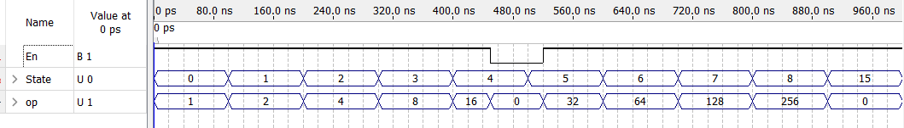
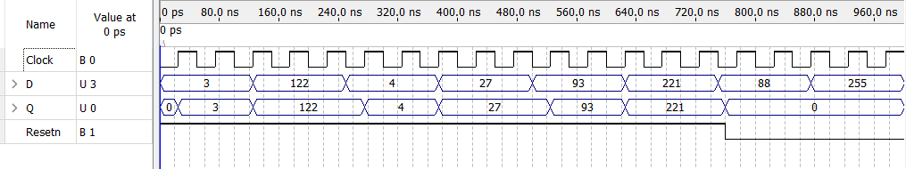
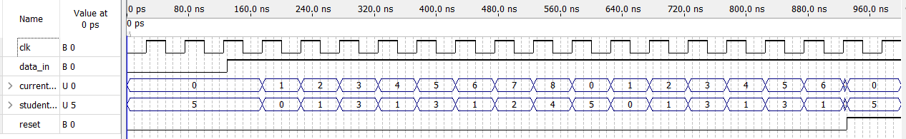
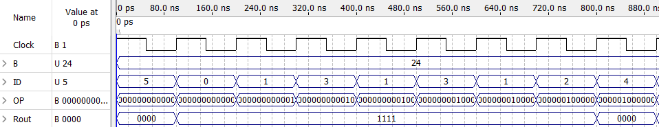
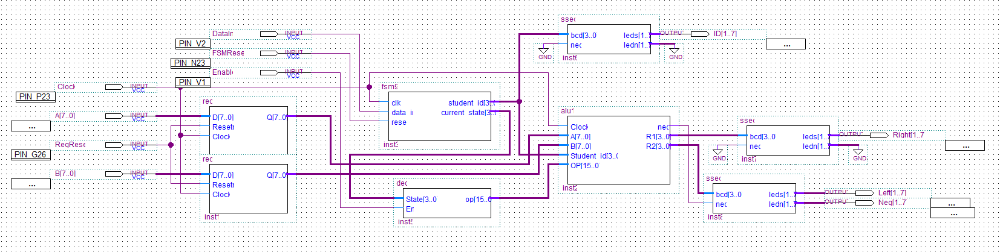
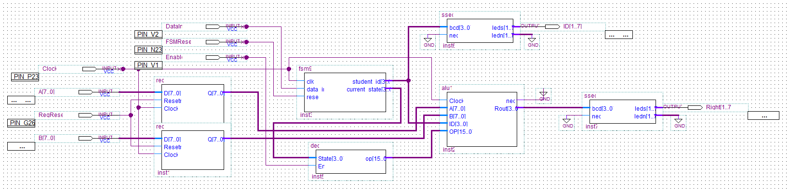

# Simple General Purpose Processor
A simplified processor system designed and implemented in VHDL using Quartus II 13.0 as part of the digital systems final lab project. The project demonstrates the design and integration of registers/latches, a finite state machine (FSM), decoder, and multiple Arithmetic Logic Units (ALUs).

## Highlights
- 8-bit latches to store and process input values.
- A finite state machine to control the processor's operation sequence.
- A 4-to-16 decoder to convert FSM states into ALU microcode.
- 3 ALU configurations:
    - ALU 1: Basic arithmetic and logical operations such as addition, subtraction, NAND, NOR, XOR, and XNOR.
    - ALU 2: Extended operations including rotations, shifts, bit inversion, and bit swapping.
    - ALU 3: Comparison-based logic producing YES/NO outputs.
- A seven-segment display output.
- Verification of functionality through VHDL simulation waveforms.
- Implementation of final design on an Altera FPGA board.

## Further Inspection
A reference version of the original project report is provided in the repository for viewing. The test waveforms and final schematics are shown below:

### 4:16 Decoder Waveform

### Latch Waveform

### Finite State Machine Waveform

### Part 3 Final Combined Waveform

### ALU 1 Schematic

### ALU 3 Schematic

The project demonstrates practical experience with digital logic design, VHDL, finite state machines, microcode-based control, modular hardware design, simulation, and FPGA implementation.
